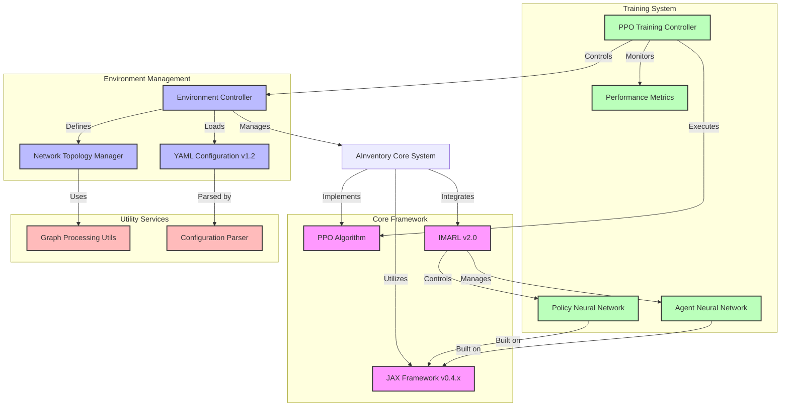

# AInventory



## A-Inventory (AI-ventory): Multi-echelon Inventory Optimization using JAX and Iterative Multi-agent Reinforcement Learning

### Overview
AInventory is a cutting-edge solution for Multi-echelon Inventory Optimization (MEIO) problems, leveraging the power of JAX and Reinforcement Learning. It implements a novel Iterative Multi-agent Reinforcement Learning (IMARL) approach combined with Proximal Policy Optimization (PPO) to tackle complex supply chain optimization challenges.

### Key Features
- **JAX-based Implementation**: Utilizing JAX for efficient, GPU-accelerated computations
- **IMARL Architecture**: Novel approach to handle complex multi-echelon systems
- **PPO Algorithm**: State-of-the-art policy optimization for robust inventory management
- **Scalable Design**: Handles various network topologies and complexity levels

### Quick Start

#### Installation
1. Clone the repository:
```bash
git clone https://github.com/DS-Capstone-2024/SupplyChainManagement
cd SupplyChainManagement
```

2. Pick a training file and run

```{python}
python train_jax_grid.py
```

Example output:

```
==================================================
Processing model: grid_1_divergent_small_1
==================================================

demand_type: CD
Fetched base stock levels from hashmap
Loaded baseline for grid_1_divergent_small_1: -2413.46
Starting 10 total runs in batches of 10

Batch 1/1 (10 runs)
Starting parallel training...
Evaluation Step: 1/100 | Reward: -13839 | New best for run 9 (previous: -inf) 

Evaluation Step: 1/100 | Reward: -13839 

Evaluation Step: 1/100 | Reward: -14145 | New best for run 8 (previous: -inf)

...
```
All the training file comes with automatic saving the model with the best weights as you train

3. Use the best the trained model for inference, for any of the approaches
```{python}
python model_inference.py --network A --complexity 3 --technique SARL --technique IMARL
```

Example Output:
```
Running inference for network: grid_1_divergent_small_3
Using Baseline for Inference:

        Node    Inventory Position      Order Placed / Action
        1               75              0
        2               -12             50
        3               -6              50
        4               2               50
==================================================
Using SARL for Inference:

        Node    Inventory Position      Order Placed / Action
        1               75              100
        2               -12             40
        3               -6              24
        4               2               48
==================================================
Using IMARL for Inference:

        Node    Inventory Position      Order Placed / Action
        1               75              41
        2               -12             50
        3               -6              50
        4               2               50
==================================================
```

To find out the various options available while running inference, simply view the help documentation by running,

```{python}
python model_inference.py --helppython model_inference.py --help
```

### Citation

If you want to use AInvetory in your research, please cite:

```{bibtex}
@software{ainventory2024,
  title={AInventory: Multi-echelon Inventory Optimization using JAX and IMARL},
  author={DS-Capstone-2024},
  year={2024},
  url={https://github.com/DS-Capstone-2024/SupplyChainManagement}
}
```

